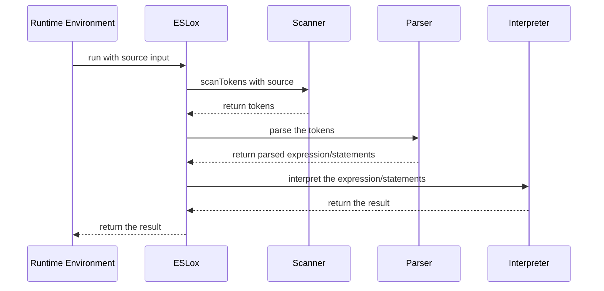

```mermaid
sequenceDiagram
    participant Runtime Environment
    participant ESLox
    participant Scanner
    participant Parser
    participant Interpreter
    Runtime Environment->>ESLox: run with source input
    ESLox->>Scanner: scanTokens with source
    Scanner-->>ESLox: return tokens
    ESLox->>Parser: parse the tokens
    Parser-->>ESLox: return parsed expression/statements
    ESLox->>Interpreter: interpret the expression/statements
    Interpreter-->>ESLox: return the result
    ESLox-->>Runtime Environment: return the result
```